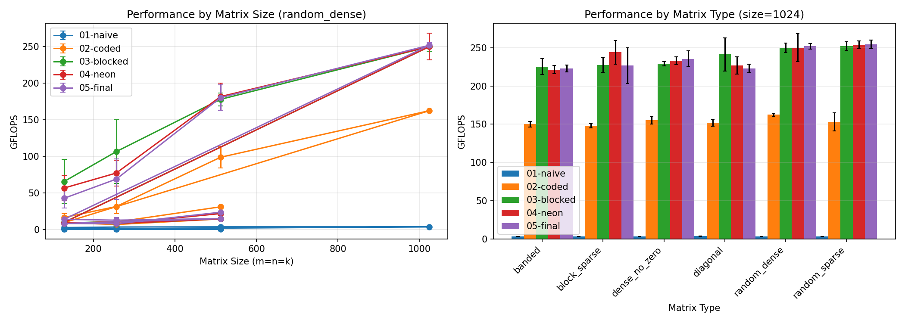

# Ternary-Binary GeMM Benchmarks

Benchmark results for ternary-binary General Matrix Multiply (GeMM) implementations on ARM processors.

## Overview

This project implements optimized GeMM operations for ternary-binary neural networks using bit-packing and SIMD instructions. Five progressive implementations are benchmarked on three different ARM devices.

## Implementations

| ID | Name | Description |
|----|------|-------------|
| 01 | naive | Baseline O(m×n×k) with bit-by-bit decoding |
| 02 | coded | Bit-packing with hardware popcount (64-bit) |
| 03 | blocked | Cache-aware blocking with tiling parameters |
| 04 | neon | NEON SIMD optimizations (128-bit operations) |
| 05 | final | Production API with modern C++ design |

## Devices Tested

| Device | CPU | Cores | L1 Cache | L2 Cache |
|--------|-----|-------|----------|----------|
| MacBook M4 Pro | Apple M4 Pro | 10 | 128 KB/core | 4 MB |
| Raspberry Pi | Cortex-A72 | 4 | 32 KB/core | 1 MB |
| Samsung A52 | Snapdragon 720G | 8 | 64 KB/core | 512 KB |

## Results Summary

### Performance Comparison


### GFLOPS by Matrix Size



### Time Distribution


### Average GFLOPS by Device

| Implementation | M4 Pro | RPi | A52 |
|----------------|--------|-----|-----|
| 01-naive | 2.89 | 0.40 | 0.52 |
| 02-coded | 69.43 | 9.73 | **15.03** |
| 03-blocked | **137.99** | 9.29 | 12.25 |
| 04-neon | 137.62 | 9.28 | 12.52 |
| 05-final | 127.30 | **12.46** | 12.77 |

### Speedup vs Naive Baseline

| Implementation | M4 Pro | RPi | A52 |
|----------------|--------|-----|-----|
| 02-coded | 24.0× | 24.4× | **29.2×** |
| 03-blocked | **47.7×** | 23.3× | 23.8× |
| 04-neon | 47.6× | 23.3× | 24.3× |
| 05-final | 44.0× | **31.2×** | 24.8× |

## Key Findings

### 1. Device-Specific Optimal Implementations

| Device | Best Implementation | GFLOPS | Why? |
|--------|---------------------|--------|------|
| **M4 Pro** | 03-blocked | 137.99 | Large caches (4 MB L2) benefit from blocking; Apple Silicon scalar popcount |
| **RPi** | 05-final | 12.46 | Modern memory management works well with limited cache |
| **A52** | 02-coded | 15.03 | Smaller caches make blocking overhead costly; simple access pattern wins |

### 2. Cache Size Impact

The optimal implementation varies significantly with cache size:

- **Large caches (M4 Pro: 4 MB L2)** → Blocking and packing overhead pays off, achieving ~138 GFLOPS
- **Medium caches (RPi: 1 MB L2)** → Final implementation with smart memory management
- **Small caches (A52: 512 KB L2)** → Simple implementation avoids overhead

### 3. Matrix Size Scaling

Performance scales dramatically with matrix size on M4 Pro:

| Size | M4 Pro | RPi | A52 |
|------|--------|-----|-----|
| 128 | 61.45 | 14.23 | 8.46 |
| 256 | 77.47 | 8.45 | 9.52 |
| 512 | 173.38 | 14.70 | **27.54** |
| 1024 | **238.18** | - | - |

### 4. Matrix Type Impact

Matrix type has moderate impact (~15% variation) on M4 Pro, minimal on other devices.

## Directory Structure

```
bench/
├── result/
│   ├── m4pro/          # MacBook M4 Pro results
│   │   ├── README.md
│   │   └── m4pro_*.csv
│   ├── rpi/            # Raspberry Pi results
│   │   ├── README.md
│   │   └── rpi_*.csv
│   └── a52/            # Samsung A52 results
│       ├── README.md
│       └── a52_*.csv
├── plots/
│   ├── plot_results.py
│   └── figures/
│       ├── device_comparison.png
│       ├── gflops_comparison.png
│       ├── time_distribution.png
│       └── statistics.csv
└── README.md           # This file
```

## How to Reproduce

### Build

```bash
cd GeMM
cmake -B build -DCMAKE_BUILD_TYPE=Release
cmake --build build
```

### Run Benchmarks

```bash
cd build/bench
for impl in 01 02 03 04 05; do
    ./bench_gemm_${impl} \
        --sizes "128,256,512" \
        --types "random_dense,random_sparse,dense_no_zero,diagonal,banded,block_sparse" \
        --runs 30 \
        --warmup 5 \
        --device "your-device" \
        --output "results_${impl}.csv"
done
```

### Generate Plots

```bash
python3 -m venv venv
source venv/bin/activate
pip install pandas matplotlib
python3 bench/plots/plot_results.py combined_results.csv --output-dir bench/plots/figures
```

## References

1. Trusov et al. "Fast matrix multiplication for binary and ternary CNNs on ARM CPU" (2022)
2. Goto & van de Geijn "Anatomy of High-Performance Matrix Multiplication" (2008)
