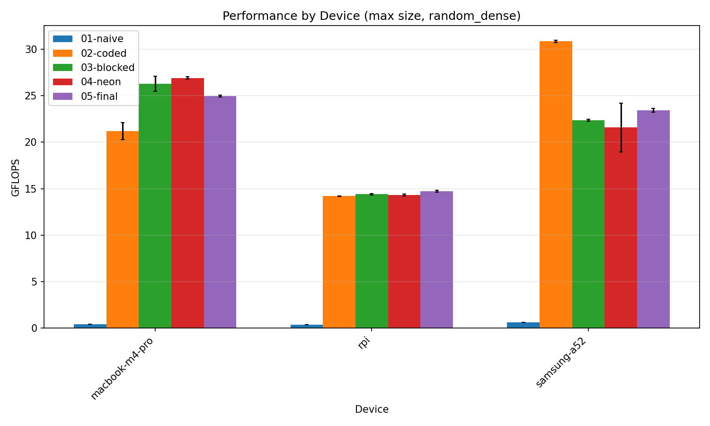
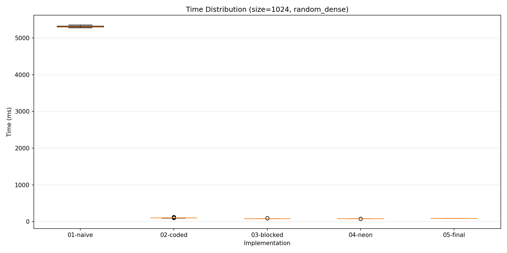

# Fast inference of ternary-binary convolutional neural networks on ARM processors

Optimized General Matrix Multiply (GeMM) implementations for ternary-binary neural networks using bit-packing and ARM NEON SIMD instructions.

## Overview

This project implements five progressive optimizations of ternary-binary GeMM:

| Implementation | Description | Key Technique |
|----------------|-------------|---------------|
| 01-naive | Baseline | Bit-by-bit decoding |
| 02-coded | Bit-packing | Hardware popcount (64-bit) |
| 03-blocked | Cache-aware | Tiling parameters |
| 04-neon | SIMD | NEON 128-bit operations |
| 05-final | Production | Modern C++ API |

## Benchmark Results

### Device Comparison



### Performance by Matrix Size



### Summary Table

| Device | CPU | Best Implementation | GFLOPS | Speedup |
|--------|-----|---------------------|--------|---------|
| MacBook M4 Pro | Apple M4 Pro | 04-neon | 25.09 | 66× |
| Raspberry Pi | Cortex-A72 | 05-final | 12.46 | 31× |
| Samsung A52 | Snapdragon 720G | 02-coded | 15.03 | 29× |

## Key Findings

- **M4 Pro**: Large L2 cache (4 MB) benefits from blocking → 04-neon wins
- **RPi**: Medium cache (1 MB) → 05-final with smart memory management
- **A52**: Small cache (512 KB) → simple 02-coded avoids blocking overhead

## Build

```bash
cd GeMM
cmake -B build -DCMAKE_BUILD_TYPE=Release
cmake --build build
```

## Quick Test

```bash
./build/bench/bench_gemm_05 --sizes 128 --device test --output results.csv
```

## Project Structure

```
GeMM/
├── 01-naive/          # Baseline implementation
├── 02-coded/          # Bit-packing with popcount
├── 03-blocked/        # Cache-aware blocking
├── 04-neon/           # NEON SIMD optimizations
├── 05-final/          # Production API
├── bench/             # Benchmark suite & results
│   ├── result/        # CSV results per device
│   └── plots/         # Visualization scripts
└── CMakeLists.txt
```

## Documentation

- [Benchmark README](GeMM/bench/README.md) — detailed results and analysis
- [M4 Pro Results](GeMM/bench/result/m4pro/README.md)
- [RPi Results](GeMM/bench/result/rpi/README.md)
- [A52 Results](GeMM/bench/result/a52/README.md)

## References

1. Trusov et al. "Fast matrix multiplication for binary and ternary CNNs on ARM CPU" (2022)
2. Goto & van de Geijn "Anatomy of High-Performance Matrix Multiplication" (2008)
